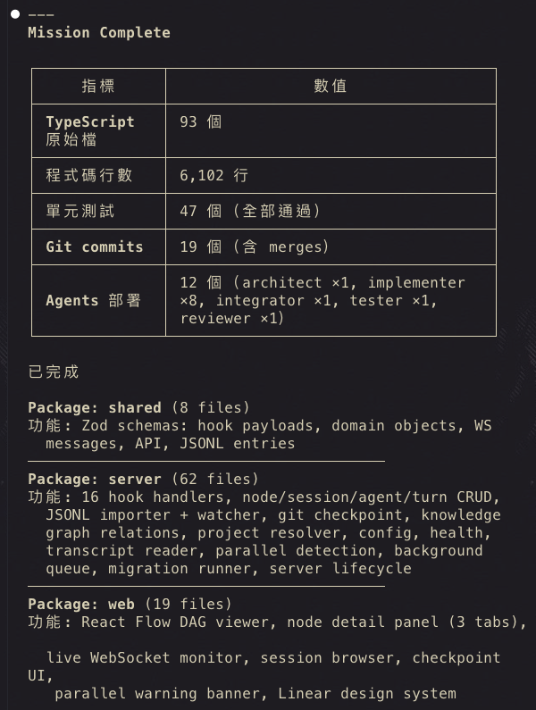
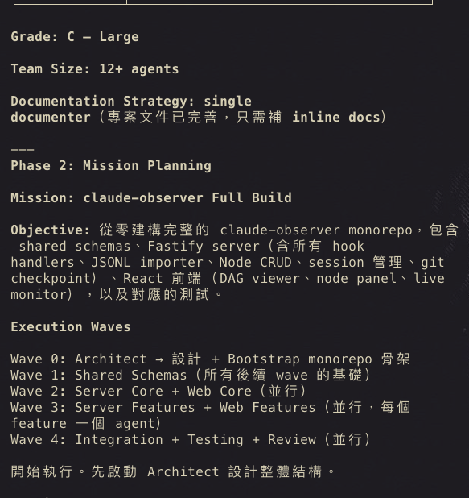
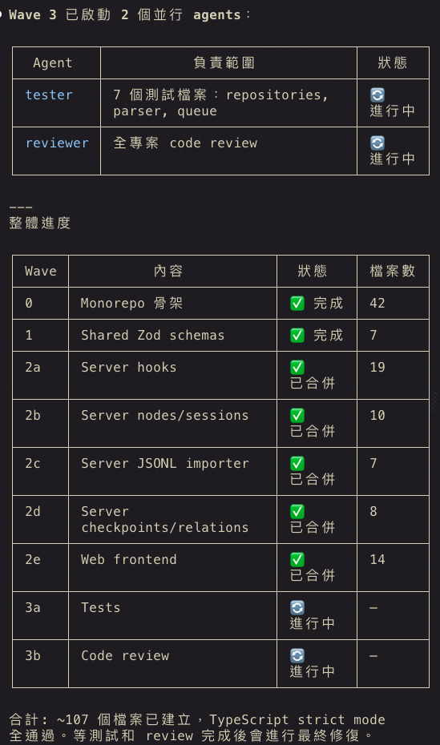
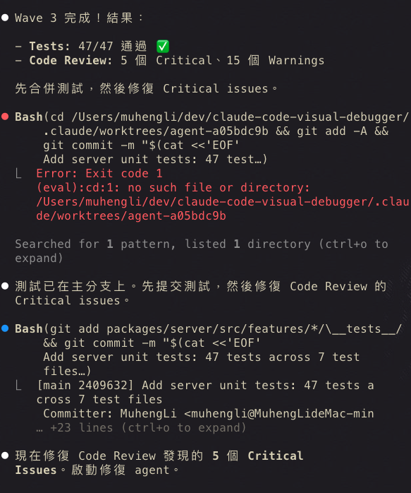

**English** | **[繁體中文](./README.zh-TW.md)**

# Agent Army — Multi-Agent Development Team for Claude Code

> **One command. 12+ AI agents build your feature automatically.**

Agent Army is an open-source plugin for [Claude Code CLI](https://claude.ai/code). Describe what you want to build, and it automatically decomposes tasks, assigns specialized agents, runs parallel development, tests, and code reviews — fully autonomous.

```bash
/agent-army:autopilot Build authentication module with JWT and role-based access control
```

That's it. Go grab a coffee. Your feature will be ready when you're back.

### Real example: Building a full-stack monorepo from scratch



<details>
<summary>See the full build process (click to expand)</summary>

**Mission Planning — Auto-decomposed into 5 execution waves:**



**Progress Overview — Waves executing in parallel:**



**Wave 3 — Tester + Reviewer running, auto-fixing critical issues:**



</details>

---

## How is this different from Claude Code's native subagents?

| | Native Claude Code | Agent Army |
|---|---|---|
| **Your role** | You're the tech lead — manually decide who to spawn and what to do | You're the boss — the agent team runs itself |
| **Specialization** | Only general-purpose agents | 5 specialized roles, each with dedicated expertise |
| **Workflow** | You orchestrate everything | Automated wave execution (design → implement → test → review) |
| **Quality assurance** | You remember to run tests (hopefully) | TDD + code review + security audit built-in and enforced |
| **Failure handling** | Agent crashes? Your problem | Auto-detect + classify + retry + graceful degradation |
| **Cross-session** | Starts from scratch every time | context-sync preserves state across sessions |

---

## 5 Specialized Agents

| Agent | Role | Scope |
|-------|------|-------|
| **Tech Lead** | Orchestrator | Decomposes tasks, assigns agents, reviews quality, resolves conflicts. **Writes no code** — only coordinates |
| **Architect** | Designer | System design, API design, data modeling. Produces designs, never implements |
| **Implementer** | Engineer | Writes code, integrates, resolves merge conflicts. Multiple can run in parallel |
| **Tester** | QA | Unit tests + integration tests + code review + security audit (OWASP) |
| **Documenter** | Docs | Writes documentation, generates reports, manages filing |

The Tech Lead automatically grades task complexity (S/A/B/C) and decides how many agents to spawn:

| Grade | Scale | Team Composition |
|-------|-------|-----------------|
| **S** | Single file change | No spawn — handles directly |
| **A** | 1-3 files | implementer + tester |
| **B** | 4-15 files | architect + implementer ×1-3 + tester + documenter |
| **C** | 15+ files | Full team, up to 5 parallel implementers |

---

## 14 Skills (Slash Commands)

### Core Development

| Command | Purpose |
|---------|---------|
| `/agent-army:autopilot [task]` | **Full auto mode**: decompose → backlog → tmux loop → execute until done |
| `/agent-army:assemble [feature]` | Launch agent team for a feature |
| `/agent-army:sprint [feature]` | Sprint planning & task decomposition |
| `/agent-army:tdd [feature]` | TDD Red-Green-Refactor enforcement |
| `/agent-army:fix [error]` | Smart diagnosis & resolution |

### Quality Assurance

| Command | Purpose |
|---------|---------|
| `/agent-army:quality-gate [scope]` | Quality checkpoint (6 gates) |
| `/agent-army:integration-test [scope]` | Integration test orchestration (5 stages) |
| `/agent-army:code-review [scope]` | Code review orchestration (4 stages) |

### Project Management

| Command | Purpose |
|---------|---------|
| `/agent-army:setup [project]` | Initialize project (templates, git hooks, CI) |
| `/agent-army:onboard [project]` | Scan project structure, generate memory bootstrap |
| `/agent-army:context-sync [mode]` | Cross-session context sync (save / load / team) |
| `/agent-army:retrospective` | Mission retrospective & self-improvement |
| `/agent-army:changelog [spec]` | Auto-generate changelog from git history |
| `/agent-army:timesheet [range]` | Work time analysis & daily report |

---

## Installation

### Option 1: Via Marketplace (Recommended)

```bash
# 1. Add the marketplace source
/plugin marketplace add Muheng1992/claude-agent-army

# 2. Install the plugin
/plugin install agent-army@claude-agent-army

# 3. Initialize your project
/agent-army:setup my-project
```

### Option 2: Local Testing

```bash
# Clone
git clone https://github.com/Muheng1992/claude-agent-army.git

# Run Claude Code with the plugin
claude --plugin-dir ./claude-agent-army
```

### Option 3: Project-scoped Install

Add to your project's `.claude/settings.json`:

```json
{
  "extraKnownMarketplaces": {
    "claude-agent-army": {
      "source": {
        "source": "github",
        "repo": "Muheng1992/claude-agent-army"
      }
    }
  },
  "enabledPlugins": {
    "agent-army@claude-agent-army": true
  }
}
```

---

## Quick Start

```bash
# 1. Let it learn your project
/agent-army:onboard my-project

# 2. Describe what you want, then let go
/agent-army:autopilot Build a REST API with user auth, CRUD endpoints, and tests

# 3. It will automatically:
#    → Analyze your codebase
#    → Decompose into 5-30 atomic tasks
#    → Launch a tmux loop
#    → Execute each task (Architect designs → Implementer codes → Tester tests)
#    → Git commit checkpoint after each task
#    → Stop when everything is done

# 4. Monitor progress
/agent-army:autopilot status

# 5. Need to stop?
/agent-army:autopilot stop
```

---

## Autopilot Safety Limits

Autopilot has built-in safeguards to prevent runaway execution:

| Limit | Default | Purpose |
|-------|---------|---------|
| Max iterations | 50 | Prevent infinite loops |
| Max cost | $25.00 | Prevent token budget blowout |
| Max duration | 240 min | Prevent indefinite runtime |
| Per-iteration cap | $5.00 | Prevent single iteration blowout |
| Cooldown | 30 sec | Rate limiting between iterations |

Every completed iteration creates a git commit with `autopilot:` prefix — rollback anytime.

Three ways to stop:
1. `/agent-army:autopilot stop` (graceful — finishes current task)
2. `tmux kill-session -t autopilot-{project}` (immediate)
3. `touch .claude/autopilot/STOP` (manual stop signal)

---

## Built-in Templates

`/agent-army:setup` installs these templates into your project:

| Category | Contents |
|----------|----------|
| **Memory** | `MEMORY.md` + structured memory files for cross-session context |
| **Git Hooks** | pre-commit (file length + secret scanning), commit-msg (format validation), pre-push (quality reminder) |
| **CI/CD** | GitHub Actions quality gate workflow (6 checks) |
| **Keybindings** | Keyboard shortcuts for common Agent Army commands |
| **Workspace** | Multi-project coordination settings |

---

## Requirements

- **Claude Code CLI** v1.0.33+
- **tmux** (required for autopilot): `brew install tmux`
- **Environment variable**: `CLAUDE_CODE_EXPERIMENTAL_AGENT_TEAMS=1`

---

## License

MIT — free to use, modify, and distribute.

---

## Author

[@Muheng1992](https://github.com/Muheng1992)
